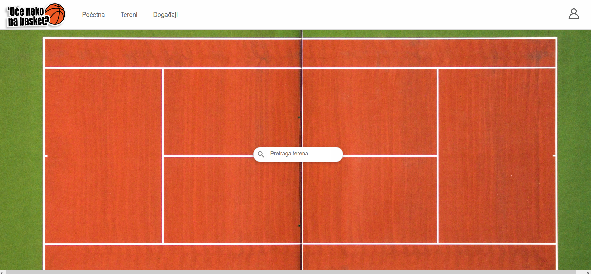

# PlatformForConnectingAthletes
## Description
University project in the form of a web application implemented in Django Rest Framework and React. It is related to the connection of sports and recreational players in the area of ​​the city of Banja Luka. Facebook login and email verification are enabled. Recreational users are able to create an activity on the desired field, to sign up for someone else's activity, comment, manipulate their activities,... The system also has business users such as sports clubs, which have the possibility of advertising sponsored events, the possibility of manipulating them,...
## Startup
Steps to start the backend (Django)
-Open the terminal and go to the directory where the backend project is located. Create and activate the virtual environment:
python -m venv venv
source venv/bin/activate
(On a Windows operating system, use the command venv\Scripts\activate for activation.)
Install the required libraries from the requirements.txt file:
pip install -r requirements.txt
Apply database migrations to create the required database structure:
python manage.py migrate
Start the Django server using the command: python manage.py runserver

Steps to start the frontend (React)
-Open the terminal and go to the directory where the frontend project is located, install: npm install, and then type command: npm start
## Screenshots

